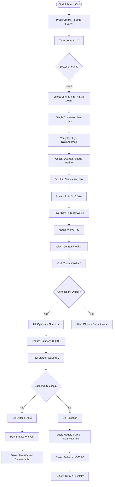
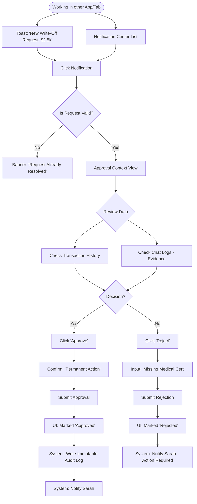
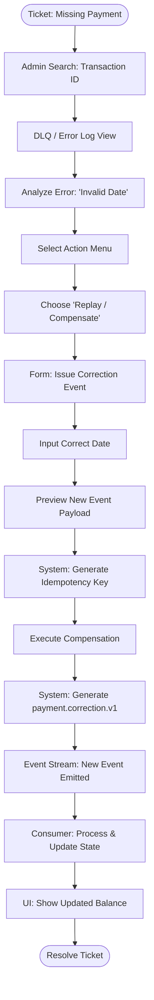

---
stepsCompleted:
  - 1
  - 2
  - 3
  - 4
  - 5
  - 6
  - 7
  - 8
  - 9
  - 10
  - 11
  - 12
  - 13
  - 14
inputDocuments:
  - docs/prd.md
  - docs/analysis/brainstorming-session-2025-12-11.md
  - docs/index.md
workflowType: 'ux-design'
lastStep: 14
project_name: 'billie-crm'
user_name: 'Rohan'
date: '2025-12-11'
---

# UX Design Specification billie-crm

**Author:** Rohan
**Date:** 2025-12-11

---

<!-- UX design content will be appended sequentially through collaborative workflow steps -->

## Executive Summary

### Project Vision

The **Billie CRM Servicing App** is a strategic modernization of an internal fintech tool. It aims to empower support staff with a unified, high-performance "shell" for managing customer loan accounts, eliminating context switching and reducing handle time. It uses a **Hybrid Next.js architecture** with **Optimistic UI** and **Intelligent Polling** to provide a "real-time" feel for financial data.

### Target Users

*   **Sarah (Support):** Needs speed and efficiency. Handles high-volume inquiries.
*   **Michael (Approver):** Needs visibility and control. Reviews write-off requests.
*   **Alex (Admin):** Needs system health visibility. Manages data integrity.
*   **Pri (Compliance):** Needs auditability. Reviews logs and permissions.

### Key Design Challenges

*   **Information Density:** The "Single Customer View" needs to pack Profile, Accounts, and Transactions into one screen without overwhelming Sarah. We need smart information hierarchy.
*   **Optimistic UI Feedback:** How do we show "Processing..." vs "Done" vs "Failed" in a way that feels instant but honest? The "Compensating Feedback" (reverting a balance) needs to be clear but not alarming.
*   **Hybrid Navigation:** Balancing the "Shell" (Next.js App Router) with the "Content" (Payload CMS) so it feels like one cohesive app, not two apps stitched together.

### Design Opportunities

*   **The "Command Bar":** Since we have a Global Search (FR1), we could make it a "Command Bar" (Cmd+K style) for power users like Alex and Michael to jump anywhere instantly.
*   **Contextual Actions:** Instead of a "Actions" menu, we can put the "Waive Fee" button right next to the Fee itself in the transaction list. Inline actions > Dropdown menus.

## Core User Experience

### Defining Experience

The core experience is **"High-Velocity Financial Servicing."** The product is successful if a user can complete the "Search → Verify → Payment" loop in under 30 seconds. The interface should feel like a cockpit: dense but organized, prioritizing "Readiness to Act" over "Exploration."

### Platform Strategy

*   **Primary:** Desktop Web (13"+ screens, Mouse/Keyboard).
*   **Secondary:** Tablet (iPad, Touch) for roving support or approvals.
*   **Input Strategy:** "Keyboard First" for power users (Search shortcuts, Tab navigation), but with "Touch-Friendly" click targets (44px+) for primary actions to support tablet usage.

### Effortless Interactions

*   **Smart Payments:** When opening the "Apply Payment" modal, the system should auto-suggest the "Total Outstanding" amount or the "Next Scheduled" amount to minimize typing.
*   **Contextual Search:** Search results should show the "Active Loan Status" immediately, so the user knows they found the right "John Smith" before clicking.

### Critical Success Moments

*   **The "Payment Posted" Feedback:** The moment the user clicks "Submit Payment", the balance *must* update instantly (Optimistic UI). If they see a spinner for 3 seconds, they will doubt the system.
*   **The "Found Them" Moment:** The search result confidence. Seeing "John Smith - Active Loan - $500 Due" in the dropdown confirms they are safe to proceed.
*   **The "Undo" Safety Net:** For 5 seconds after a write action, provide a one-click "Undo" to instantly send a compensating event, building confidence in speed.

### Experience Principles

1.  **Safe Speed:** Speed is not just fast clicks; it's speed without fear. High-context guardrails (e.g., "Active Loan" context) prevent errors before they happen, allowing staff to move fast confidently.
2.  **Context Over Navigation:** Bring the action to the data. Don't make users go to a "Payment Page"; let them pay *from* the "Account Card".
3.  **Forgiving Precision:** Financials must be precise ($0.01 matters), but inputs should be forgiving (auto-formatting currency, handling copy-pasted spaces).
4.  **Visual Distinctiveness:** Status states (Active vs. Arrears) must be visually distinct (Color + Icon) to support multi-tasking users who may not be looking directly at the screen.

## Desired Emotional Response

### Primary Emotional Goals

*   **Empowered & In Control:** Users should feel like they have a "Modern Productivity" tool (like Linear/Stripe)—clean, fast, and organized. Not a dense, intimidating "Bloomberg Terminal."
*   **Trust:** The system responds instantly (Optimistic UI), building trust that "it just works."
*   **Calm Efficiency:** The UI uses "Progressive Disclosure" to keep the main view clean, hiding complex details in drill-downs or slide-overs until needed.

### Emotional Journey Mapping

*   **Discovery (Start of Shift):** A clean, focused workspace. "Ready to Search".
*   **Action (During Call):** "Light & Fast". Interactions feel snappy.
*   **Recovery ("Oh S**t"):** "Controlled Recovery". Immediate "Undo" option preventing panic.
*   **Completion (End of Call):** "Closure". A clear way (e.g., `Esc` or `Clear`) to reset the context instantly.

### Micro-Emotions

*   **Relief:** When the "Search" instantly finds the right "John Smith" with context.
*   **Confidence:** When the "Balance" updates to $0.00 instantly after payment.
*   **Safety:** Knowing the "Undo" button is there.

### Design Implications

*   **Scannable Density:** Use typography (bolding) and badges to create scan paths. Don't just jam data into rows.
*   **Progressive Disclosure:** Keep the main dashboard focused on *Actionable* data. Use Modals or Slide-Overs for deep history or complex logs.
*   **Approachable Power:** Keyboard shortcuts (`Cmd+K`) exist for power users, but buttons are obvious and friendly for new users.
*   **Feedback Loops:** Use **Toast Notifications** for success/failure/undo.

### Emotional Design Principles

1.  **Modern Productivity:** Fast, clean, and inviting. Not dense and dark.
2.  **Forgiveness by Design:** Allow speed by making errors cheap to fix (Undo > Confirm).
3.  **Responsiveness is Quality:** Latency kills the feeling of power. Optimistic UI is non-negotiable.

## UX Pattern Analysis & Inspiration

### Inspiring Products Analysis (Industry Benchmarks)

*   **Linear (Issue Tracking):**
    *   *Why it works:* Masters "Scannable Density" and "Keyboard Speed".
    *   *Lesson for Billie:* Use `Cmd+K` command palettes and bold typography to make dense lists readable.
*   **Stripe (Dashboard):**
    *   *Why it works:* "Actionable Data". Every row in a table has a clear "Status" badge and immediate context menu.
    *   *Lesson for Billie:* Use clear status badges (e.g., "Active", "Arrears") that double as filters.
*   **Monzo/Up (Modern Banking):**
    *   *Why it works:* "Human-Readable Transactions". Instead of `POS DEBIT 4455`, they show `Woolworths` + Logo.
    *   *Lesson for Billie:* Clean up the raw ledger data into human-readable merchant names and categories.

### Transferable UX Patterns

*   **The Command Palette (Cmd+K):** Adopted from Linear/VS Code. Allows power users (Alex/Michael) to jump to "Settings" or "User: John Smith" without touching the mouse.
*   **The Slide-Over (Drawer):** Instead of a modal covering the data, use a Slide-Over for "Transaction Details". This keeps the "List Context" visible while drilling down.
*   **Inline Actions:** Hovering over a row reveals actions ("Waive", "Refund") immediately, reducing clicks.

### Anti-Patterns to Avoid

*   **Mystery Meat Navigation:** Avoid icon-only buttons. In a financial tool, clarity > minimalism. All actions must have tooltips or text labels.
*   **Modals on Modals:** Never nest modals. If a "Waive Fee" modal needs a confirmation, do it inline or replace the modal content. Do not pop a second modal over the first.
*   **The "Spinner of Death":** Never block the UI for a read operation. Use "Skeleton Loaders" (shimmer effects) to keep the UI feeling responsive while data loads.

### Design Inspiration Strategy

*   **Adopt:** Linear's "List Design" (Compact, high contrast, keyboard friendly).
*   **Adapt:** Stripe's "Payment Modal" (Clean, forgiving inputs, clear success states).
*   **Avoid:** Traditional Banking "Tab Overload" (Don't hide critical data 5 clicks deep).

## Design System Foundation

### 1.1 Design System Choice

**Payload-Native Component Library** (Extending Payload CMS Design System)

### Rationale for Selection

1.  **Consistency as a Feature:** The "Servicing App" lives *inside* the Payload Admin UI (injected via `components.views.edit`). Introducing a third-party system (like shadcn/ui) would create visual jarring and break the "Zero Context Switching" promise.
2.  **Implementation Speed:** Reusing Payload's existing React components and CSS variables (`--theme-success-500`) allows us to build faster and maintain fewer dependencies.
3.  **Unified Experience:** The user shouldn't know they are moving between "Payload Core" (User Management) and "Billie Custom" (Loan Servicing). It should feel like one product.

### Implementation Approach

*   **Base Styles:** Utilize Payload's SCSS/CSS Variables for colors, spacing, and typography.
*   **Component Strategy:** Build a `src/components/ui/` library that wraps or mimics Payload's internal components (e.g., `Button`, `Table`, `Modal`) to ensure pixel-perfect matching.
*   **Icons:** Use Payload's existing icon set (likely Lucide or similar) to match navigation.

### Customization Strategy

*   **High Density Override:** We will create a specific `high-density.module.css` to override Payload's default "comfortable" spacing for the Transaction List, achieving the "Modern Productivity" feel without breaking the system.
*   **Status Badges:** We will extend the theme to include specific Financial Status colors (e.g., "Arrears Red") that might not exist in the default CMS palette.

## Visual Design Foundation

### Color System

**Brand:**
*   **Primary:** Billie Blue (`#00A3FF`) - From website/logo.
*   **Secondary:** White (`#FFFFFF`) / Dark Navy (`#0A1929`) for contrast.

**Semantic Mapping (Payload Extended):**
*   **Action:** `--theme-primary-500` (Billie Blue) for primary buttons.
*   **Success:** `--theme-success-500` (Green) for "Paid" / "Waived".
*   **Warning:** `--theme-warning-500` (Orange) for "Overdue".
*   **Error:** `--theme-error-500` (Red) for "Arrears" / "Write-Off".
*   **Neutral:** `--theme-elevation-100` to `500` for backgrounds and cards.

### Typography System

**Font Family:**
*   **Primary:** **Inter** (Clean, Modern Sans-Serif). Excellent readability for numbers and dense tables. Overrides Payload's system font stack for the custom views.

**Hierarchy:**
*   **H1:** 24px/32px (Page Titles)
*   **H2:** 20px/28px (Section Headers)
*   **H3:** 16px/24px (Card Titles)
*   **Body:** 14px/20px (Standard Text)
*   **Caption:** 12px/16px (Metadata, Timestamps)
*   **Mono:** 13px (Transaction IDs, Reference Numbers)

### Spacing & Layout Foundation

**Density Strategy:**
*   **Compact Mode:** 4px baseline grid.
*   **Table Rows:** 40px height (standard) -> 32px height (dense mode for Power Users).
*   **Card Padding:** 16px (internal) / 24px (container).

**Layout Principles:**
1.  **The "L" Frame:** Sidebar (Nav) + Header (Command Bar) frame the content.
2.  **100% Height:** The "Servicing View" should fill the viewport (no window scroll), with internal scrolling for the Transaction List. This mimics a desktop app.

### Accessibility Considerations

*   **Contrast:** All text on backgrounds must meet WCAG AA (4.5:1).
*   **Focus States:** Custom components must have visible focus rings (`ring-2 ring-primary`) for keyboard navigation.
*   **Semantic HTML:** Use native `<button>`, `<table>`, and `<input>` elements to ensure screen reader compatibility.

## Design Direction Decision

### Design Directions Explored

We generated a "Design Direction Showcase" (`docs/ux-design-directions.html.html`) focusing on the **"Modern Productivity"** direction.

**Key Visualized Concepts:**
1.  **Payload Shell Integration:** Dark Sidebar + Light Content area to match the CMS.
2.  **High-Density Dashboard:** 2-column grid with a "Balance Card" (Action focus) and "Transaction List" (Data focus).
3.  **Smart Contextual Actions:** Hover-reveal "Waive" buttons in the table.
4.  **Optimistic UI:** Toast notifications with "Undo" capabilities.

### Chosen Direction

**Direction: "Payload Extended Modern"**
We are adopting the visual language of Payload CMS but upgrading the density and interaction patterns for high-velocity work.

### Design Rationale

*   **Why this layout?** The 2-column grid puts the "Call to Action" (Pay/Actions) on the left and the "Evidence" (History) on the right, matching the natural reading order for support calls (Verify Identity -> Check Balance -> Review History -> Act).
*   **Why this density?** The 40px row height strikes the perfect balance between "Touch Friendly" (iPad) and "Information Dense" (Desktop).
*   **Why these colors?** The "Billie Blue" primary action button stands out clearly against the neutral Payload gray background, guiding the user to the "Happy Path".

### Implementation Approach

1.  **Layout:** Implement a `DashboardLayout` component that slots into Payload's `AdminView`.
2.  **Components:** Build `BalanceCard` and `TransactionTable` using Tailwind utility classes that map to Payload CSS variables.
3.  **Interactions:** Implement the "Hover Actions" using CSS `group-hover` classes for zero-JS overhead.

## User Journey Flows

### Journey 1: Sarah's "One-Call Resolution" (Core Servicing Loop)

**Goal:** Identify customer, analyze balance, and waive a fee in < 90 seconds.
**Key Interactions:** Global Search, Single Customer View, Optimistic Fee Waiver.

**Flow Optimization:**
*   **Pre-Fetch:** When hovering the search result, pre-fetch the Customer Profile to make the page load instant.
*   **Default Selection:** In the Waiver Modal, default the amount to the full fee amount to save keystrokes.
*   **Optimistic Feedback:** The Balance Card updates *immediately* upon clicking "Submit", visually reinforcing that the task is "done" so Sarah can wrap up the call.
*   **Robustness:** Explicit connection check prevents "Lying UI" when offline. Persistent failure alerts ensure Sarah doesn't miss a backend rejection.

### Journey 2: Michael's "Frictionless Approval" (Supervisor Loop)

**Goal:** Review and approve a Write-Off request without losing context.
**Key Interactions:** Toast Notification, Deep Linking, Approval Context, Audit Logging.

**Flow Optimization:**
*   **Context Preservation:** The Approval View opens in a "Focus Mode" or dedicated layout that shows the *request* alongside the *evidence* (Customer View), so Michael doesn't have to hunt for the customer profile.
*   **One-Click History:** The "Transaction History" is filtered by default to show the events leading up to the write-off request.
*   **Stale Data Handling:** Prevents confusion if Michael opens a notification for a request that another supervisor already handled.

### Journey 3: Alex's "System Guardian" (Correction Loop)

**Goal:** Fix data inconsistency using compensating events (Replay/Compensate).
**Key Interactions:** Admin Console, DLQ, Replay Tool, Compensating Event.

**Flow Optimization:**
*   **Safety Preview:** Before executing, show a "Diff" of the event payload (Old vs. New) to prevent Alex from making a second mistake.
*   **Linkage:** The new event explicitly references the `correlation_id` of the failed event, maintaining the audit trail.
*   **Idempotency:** The system generates a unique key *before* submission to prevent accidental double-execution if Alex double-clicks.

### Journey Patterns

1.  **The "Optimistic Action" Pattern:**
    *   **Trigger:** User initiates a write action (Pay, Waive, Update).
    *   **Check:** Is Connection Online?
    *   **Immediate:** UI updates local state (Balance changes, Badge appears).
    *   **Background:** Request sent to API -> gRPC -> Ledger.
    *   **Reconciliation:** Success = Silent sync checkmark. Failure = Persistent "Alert" banner requiring dismissal + Auto-Revert.

2.  **The "Contextual Slide-Over" Pattern:**
    *   **Trigger:** Clicking a line item (Transaction, Log Entry) in a dense list.
    *   **Action:** A drawer slides in from the right (40% width).
    *   **Benefit:** Keeps the "List Context" visible (to compare with other rows) while showing "Item Details" (Metadata, JSON payloads).

3.  **The "Command Navigation" Pattern:**
    *   **Trigger:** `Cmd+K` (Mac) or `Ctrl+K` (Windows).
    *   **Action:** Opens a global command palette.
    *   **Scope:** Search Customers, Navigate to Pages ("Go to Approvals"), or execute global actions ("New Ticket").

4.  **The "Idempotent Action" Pattern:**
    *   **Use Case:** Money movement or critical corrections.
    *   **Mechanism:** UI generates a unique `idempotency_key` (UUID) when the form loads or validates.
    *   **Result:** Repeated clicks send the same key, ensuring the backend processes it exactly once.

### Flow Optimization Principles

1.  **"Don't Make Me Wait":** Use Optimistic UI for *everything* except irreversible destructive actions (like Delete Customer).
2.  **"Don't Make Me Think":** Default inputs to the most likely value (e.g., "Full Balance" for repayment, "Today" for date).
3.  **"Show Me The Proof":** For Admins/Approvers, always show the "Raw Data" toggle to inspect the actual JSON event payload, building trust in the abstraction.

## Component Strategy

### Design System Components

**Foundation:** Payload CMS (Extended)
**Core Libraries:**
*   **UI Primitives:** `payload/components/forms` (TextInput, Select), `payload/components/elements` (Button, Card).
*   **Headless Logic:** `@tanstack/react-table` (Complex Data Tables), `cmdk` (Command Palette).
*   **State Management:** `zustand` (Optimistic State & Undo Queue).

**Analysis of Coverage:**
Payload provides excellent form inputs and layout shells (`Gutter`, `Sidebar`), but its default `Table` component is designed for CMS content management (low density), not high-velocity financial data. Similarly, standard "Toast" notifications are informational, not transactional (no Undo).

### Custom Components

#### **`CommandBar` (Client Component)**
*   **Purpose:** Global navigation and search initiator.
*   **Technical Base:** `cmdk` (Accessible, Headless).
*   **Data Source:** Server-Side Search API (via `useQuery` hook) + Static Navigation Items.
*   **Behavior:**
    *   `Cmd+K` opens modal.
    *   Debounced API calls for "Customers" and "Transactions".
    *   Local filtering for "Navigation" (e.g., "Go to Approvals").
*   **Accessibility:** Full keyboard navigation (Arrows, Enter, Esc).

#### **`BalanceCard` (Client Component)**
*   **Purpose:** The "Action Center" for the Customer View.
*   **Content:** Large Currency Display, Status Pill, Action Buttons.
*   **Behavior:**
    *   Subscribes to `OptimisticStore` to show greyed-out "Pending" values immediately.
    *   Buttons (Pay, Waive) trigger Modals.
*   **Variants:** `Default`, `Arrears` (Red text/border), `Loading` (Skeleton).

#### **`TransactionTable` (Client Component)**
*   **Purpose:** High-density, virtualized list of financial events.
*   **Technical Base:** `@tanstack/react-table` (Headless Logic) + Custom Styles.
*   **Why Custom?** Need virtualization (scrolling 10k rows) and "Hover Actions" which standard Payload tables don't support.
*   **Features:**
    *   Sticky Header.
    *   Row Virtualization (using `@tanstack/react-virtual`).
    *   Right-aligned "Hover Actions" cell (visible on row hover).

#### **`OptimisticToast` (Client Component)**
*   **Purpose:** Transactional feedback with "Undo" capability.
*   **Technical Base:** Custom Portal or extending `sonner`.
*   **Behavior:**
    *   Controlled by `MutationManager`.
    *   Persists for 5s (Undo window) or until dismissed (Error).
    *   Layout: Icon + Message + Undo Button.

#### **`ContextDrawer` (Client Component)**
*   **Purpose:** Non-blocking detail view.
*   **Behavior:**
    *   Overlay that slides from right.
    *   Accepts `children` to render "Transaction Details" or "Log Payload".
    *   Manages focus trap when open.

### Component Implementation Strategy

**The "Facade" Pattern:**
We will build our custom components to *look* like Payload components but act like high-performance app components.
*   **Styles:** Use Payload's CSS variables (`--theme-primary-500`) for consistency.
*   **Structure:** Wrap headless libraries (`cmdk`, `tanstack-table`) in our own styled containers.

**Server vs. Client Split:**
*   **Page Shells (`page.tsx`):** Server Components. Fetch initial data (Customer Profile, Recent Transactions).
*   **Interactive Islands:** `TransactionTable`, `BalanceCard`, and `CommandBar` are Client Components (`use client`) to handle interactivity and optimistic updates.

### Implementation Roadmap

**Phase 1: The "Shell" (Weeks 1-3)**
*   *Priority:* Critical for MVP.
*   *Components:* `CommandBar` (Nav), `BalanceCard` (View), `TransactionTable` (List).
*   *Goal:* Replicate the "Read-Only" legacy experience but faster.

**Phase 2: The "Guardrails" (Weeks 4-5)**
*   *Priority:* Critical for "Write" actions.
*   *Components:* `OptimisticToast` (Safety), `MutationManager` (Logic), `ContextDrawer` (Details).
*   *Goal:* Enable "Waive Fee" and "Approvals" with safety nets.

**Phase 3: The "Polish" (Week 6)**
*   *Priority:* Enhancements.
*   *Components:* `StatusBadge` (with tooltips), `SkeletonLoader` (shimmer effects).

## UX Consistency Patterns

### Button Hierarchy

*   **Primary (Solid Blue):** The single main goal of a screen (Save, Pay, Search). Mapped to `Cmd+Enter`.
*   **Secondary (Ghost/Outline):** Alternative paths (Cancel, Export). Mapped to `Esc` (for Cancel).
*   **Destructive (Red):** Irreversible actions (Write-Off). *Always* paired with a confirmation modal.

### Feedback Patterns (The "Truth Scale")

| State | Visual | Persistence |
| :--- | :--- | :--- |
| **Optimistic** | Greyed-out data, "Processing" Toast | Temporary (until sync) |
| **Synced** | Solid data, "Success" Toast | Short (3s) |
| **Error** | Reverted data, "Failed" Alert | **Sticky** (Requires dismissal) |

### Form Patterns

*   **Smart Inputs:** Currency inputs ignore non-numeric chars (except decimal).
*   **Focus Management:** Opening a modal *always* focuses the first input.
*   **Forgiving Format:** Pasting "$1,200.50" strips formatting and stores `1200.50`.

### Navigation Patterns

*   **Global Hotkeys:** `Cmd+K` (Search), `?` (Help/Shortcuts).
*   **List Traversal:** `j/k` for row navigation. `Enter` to view details.
*   **Escape Hatch:** `Esc` closes the deepest layer (Modal > Drawer > Search).

### Modal vs. Slide-Over Rules

1.  **Slide-Over:** For *Reading* data (Logs, History) without losing context.
2.  **Modal:** For *Writing* data (Forms, Decisions) requiring focus.
3.  **Never Nest:** Never open a Modal from a Modal. Use a "Step" wizard instead.

## Responsive Design & Accessibility

### Responsive Strategy

**Primary Target:** Desktop (13" MacBook Air and larger).
**Secondary Target:** Tablet (iPad Pro/Air).
**Tertiary Target:** Mobile (iPhone) - primarily for Approvals (Journey 2).

| Breakpoint | Layout Strategy | Interaction Model |
| :--- | :--- | :--- |
| **Desktop (>1024px)** | **3-Pane Dashboard:** Sidebar + Activity Feed + Context. | **Mouse & Keyboard:** Hover actions, right-clicks, `Cmd+K` dominant. |
| **Tablet (768-1024px)** | **2-Pane Focused:** Sidebar collapses to Icons. Context opens in **Slide-Over**. | **Touch Hybrid:** 44px+ touch targets. Swipe actions replace hover actions. |
| **Mobile (<768px)** | **Single Column Stack:** Stacked cards. Navigation moves to Bottom Sheet. | **Touch Only:** "Thumb Zone" navigation. Tables convert to "Card Lists". |

### Mobile Adaptation Rules

1.  **The "Table-to-Card" Transformation:**
    *   On Desktop, the Transaction List is a high-density table.
    *   On Mobile, it transforms into a list of Cards (Merchant Name + Amount + Date), hiding non-essential metadata behind a tap.
2.  **Touch Targets:**
    *   In "Touch Mode" (detected via media query), row heights increase from 32px/40px to **48px**.
    *   Action buttons (Waive) move from "Hover" to a "Swipe Left" gesture or a "More (...)" menu.

### Accessibility Strategy (WCAG 2.1 AA)

**1. Keyboard Power User (The "Sarah" Requirement):**
*   **No Mouse Needed:** Every action (Search, Pay, Waive) must be reachable via keyboard.
*   **Focus Management:** When a Slide-Over closes, focus must return *exactly* to the row that opened it.
*   **Skip Links:** "Skip to Main Content" is essential due to the dense sidebar.

**2. Screen Reader Optimization:**
*   **Optimistic UI Annoucements:** When a balance updates optimistically, we must use `aria-live="polite"` to announce "Balance updated to zero" so visually impaired staff know the action succeeded.
*   **Status Badges:** "Active" or "Overdue" pills must have hidden text (e.g., `Status: Overdue`) to provide context.

**3. Cognitive Accessibility:**
*   **Reduced Motion:** Respect `prefers-reduced-motion` by disabling the "Slide-Over" animation and replacing it with a simple fade-in.
*   **Clear Error Recovery:** Error messages must identify the input (`aria-describedby`) and offer a text-based solution, not just a red border.
